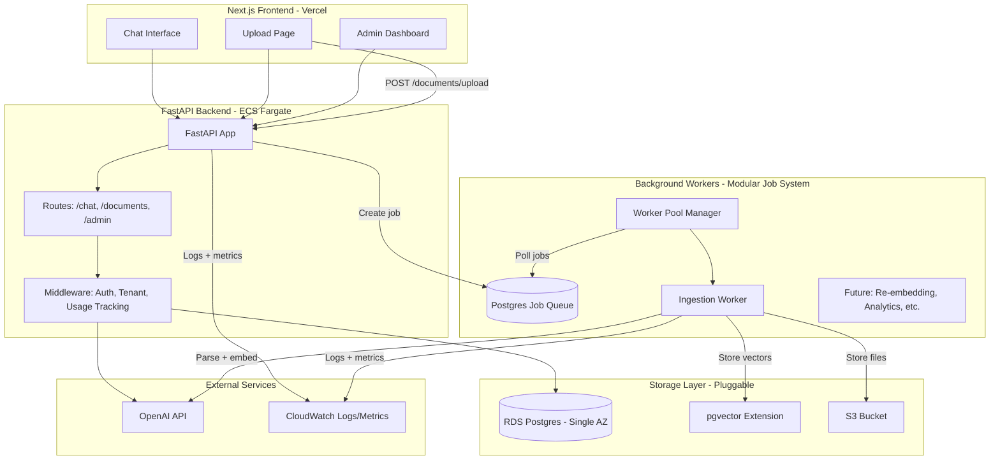

# Munitor AI Production Build Plan — FastAPI + Next.js on AWS

## Philosophy: Build for Scalability, Ship for Validation

**Months 0-3 Goal**: Get 3 paying customers live with a production-grade system that can scale cleanly.

**Months 6+ Goal**: Scale infrastructure as revenue validates assumptions.

**Core Principle**: Every component is designed with modularity and scalability in mind, even if we start simple. The architecture allows incremental upgrades without rewrites.

---

## Overview

Build the production architecture directly (skip Streamlit MVP). FastAPI backend + Next.js frontend, deployed on AWS with proper multi-tenant isolation.

**Keep**: All existing backend modules (`src/llm/`, `src/vectorstore/`, `src/ingestion/`, `src/retrieval/`) — they're already production-ready and modular.

**Build new**: FastAPI API layer + Next.js frontend + AWS infrastructure, with emphasis on modular, scalable design patterns.

---

## Architecture: Phase 0 (Months 0-3)



**Phase 0 Stack** (Simplified for speed):
- ✅ **FastAPI** + **Postgres** (single-AZ, db.t3.small) + **pgvector** (vectors in Postgres)
- ✅ **S3** (document storage)
- ✅ **Background workers** (Postgres job queue, no Redis needed yet)
- ❌ **Pinecone** (use pgvector instead — zero external dependencies)
- ❌ **Redis/ElastiCache** (add when needed for caching/sessions)
- ❌ **Multi-AZ RDS** (single-AZ is fine for 1-3 customers)
- ❌ **Streaming responses** (nice-to-have, add later)

**Migration Path**: Each component can be upgraded independently without breaking changes.

---

## Project Structure (Modular & Scalable)

```
FinTek/
├── src/
│   ├── core/              # ✅ Already built: config, types, shared utilities
│   ├── llm/               # ✅ Already built: provider abstraction (modular)
│   ├── vectorstore/       # ✅ Already built: base abstraction + NEW: pgvector_store.py
│   ├── ingestion/         # ✅ Already built: modular parsers, chunking strategies
│   ├── retrieval/         # ✅ Already built: RAG engine (pluggable components)
│   ├── utils/             # ✅ Already built: logging, query_store
│   ├── api/               # 🆕 BUILD: FastAPI application (modular routes)
│   │   ├── __init__.py
│   │   ├── main.py        # FastAPI app, CORS, middleware, router mounting
│   │   ├── deps.py        # Shared dependencies (modular, reusable)
│   │   ├── middleware.py  # Auth, tenant resolution, usage tracking, logging
│   │   ├── routes/
│   │   │   ├── __init__.py
│   │   │   ├── auth.py    # POST /api/v1/auth/login, /refresh
│   │   │   ├── chat.py     # POST /api/v1/chat (non-streaming initially)
│   │   │   ├── documents.py # GET/POST/DELETE /api/v1/documents
│   │   │   └── admin.py   # GET /api/v1/admin/analytics, /knowledge-gaps
│   │   └── models/        # Pydantic request/response models (versioned)
│   │       ├── chat.py
│   │       ├── documents.py
│   │       └── admin.py
│   ├── db/                # 🆕 BUILD: Database layer (modular, migration-friendly)
│   │   ├── __init__.py
│   │   ├── connection.py  # SQLAlchemy engine, session factory, tenant-scoped sessions
│   │   ├── models.py      # SQLAlchemy models (modular, versioned)
│   │   │                  # - Tenant, User, Document, DocumentChunk (with embedding versioning)
│   │   │                  # - IngestionJob, UsageLog, TenantUsageLimits
│   │   └── migrations/    # Alembic migrations (versioned, reversible)
│   ├── workers/           # 🆕 BUILD: Background workers (modular job system)
│   │   ├── __init__.py
│   │   ├── base.py        # Base worker interface, job queue abstraction
│   │   ├── manager.py     # Worker pool manager (scalable to multiple workers)
│   │   ├── ingestion_worker.py  # Ingestion worker (modular, can add more workers)
│   │   └── job_queue.py   # Postgres-based job queue (pluggable, can swap to Redis later)
│   ├── storage/           # 🆕 BUILD: Storage abstraction (pluggable)
│   │   ├── __init__.py
│   │   ├── base.py        # Base storage interface
│   │   └── s3_client.py   # S3 implementation (can add Azure Blob, GCS later)
│   └── transformations/   # 🆕 BUILD: Data transformation pipeline (modular, versioned)
│       ├── __init__.py
│       ├── base.py        # Base transformer interface
│       ├── parsers.py     # Document parsers (modular, extensible)
│       ├── chunkers.py    # Chunking strategies (pluggable)
│       ├── embedders.py   # Embedding generation (versioned, model-aware)
│       └── versioning.py  # Model versioning, re-embedding logic
├── web/                   # 🆕 BUILD: Next.js frontend
│   └── [Next.js structure - modular components]
├── infrastructure/
│   └── terraform/         # Simplified Terraform (modular, can add Redis/Pinecone later)
│       ├── main.tf
│       ├── ecs.tf          # Single ECS task (API + worker) - scalable to multiple
│       ├── rds.tf          # Single-AZ RDS, pgvector extension
│       ├── s3.tf
│       └── alb.tf
└── config/
    └── settings.yaml      # ✅ Already exists
```

---

## Key Design Principles: Scalability & Modularity

### 1. **Pluggable Components**

Every major component implements an interface/abstract base class:
- **Vector Store**: `BaseVectorStore` → `PostgresVectorStore` (can add `PineconeVectorStore` later)
- **Storage**: `BaseStorage` → `S3Storage` (can add `AzureBlobStorage` later)
- **LLM Provider**: `BaseLLMProvider` → `OpenAIProvider` (can add `AnthropicProvider` later)
- **Worker**: `BaseWorker` → `IngestionWorker` (can add `ReembeddingWorker`, `AnalyticsWorker` later)
- **Transformer**: `BaseTransformer` → `DocumentTransformer` (can add custom transformers)

**Benefit**: Swap implementations without changing business logic.

### 2. **Versioned Data Models**

- **Embedding versions**: Store `embedding_model` and `embedding_version` in `document_chunks`
- **Model versions**: Track which LLM model was used for each query
- **Schema migrations**: Alembic migrations are versioned and reversible

**Benefit**: Can re-embed documents, A/B test models, roll back if needed.

### 3. **Modular Job System**

- **Job queue abstraction**: `BaseJobQueue` → `PostgresJobQueue` (can swap to `RedisJobQueue` later)
- **Worker interface**: `BaseWorker` → `IngestionWorker` (can add more workers without changes)
- **Job types**: Each job type is a separate module (`IngestionJob`, `ReembeddingJob`, etc.)

**Benefit**: Add new job types, scale workers horizontally, swap queue backend.

### 4. **Data Transformation Pipeline**

- **Modular stages**: Parse → Chunk → Embed → Store (each stage is pluggable)
- **Version tracking**: Every transformation knows its model version
- **Replay capability**: Can re-run transformations with new models

**Benefit**: Upgrade models incrementally, maintain data lineage, support A/B testing.

---

## Implementation Phases

### Phase 0.1: Database + Models (Week 1)

**Focus**: Modular, versioned schema that supports future migrations.

#### Database Schema (Modular Design)

**Core Tables**:
```sql
-- Tenant isolation (logical, not schema-per-tenant initially)
CREATE TABLE tenants (
    id UUID PRIMARY KEY DEFAULT gen_random_uuid(),
    name TEXT NOT NULL,
    slug TEXT UNIQUE NOT NULL,
    created_at TIMESTAMPTZ NOT NULL DEFAULT NOW()
);

-- Users (Clerk integration)
CREATE TABLE users (
    id UUID PRIMARY KEY DEFAULT gen_random_uuid(),
    tenant_id UUID NOT NULL REFERENCES tenants(id),
    email TEXT NOT NULL,
    role TEXT NOT NULL DEFAULT 'user', -- 'admin', 'user'
    clerk_user_id TEXT UNIQUE NOT NULL,
    created_at TIMESTAMPTZ NOT NULL DEFAULT NOW()
);

-- Documents (versioned, supports re-embedding)
CREATE TABLE documents (
    id UUID PRIMARY KEY DEFAULT gen_random_uuid(),
    tenant_id UUID NOT NULL REFERENCES tenants(id),
    filename TEXT NOT NULL,
    s3_key TEXT NOT NULL,
    file_type TEXT NOT NULL,
    ingested_at TIMESTAMPTZ,
    chunk_count INTEGER DEFAULT 0,
    embedding_model TEXT, -- 'text-embedding-3-small'
    embedding_version INTEGER DEFAULT 1,
    status TEXT NOT NULL DEFAULT 'pending', -- 'pending', 'processing', 'completed', 'failed'
    metadata JSONB,
    created_at TIMESTAMPTZ NOT NULL DEFAULT NOW()
);

-- Document chunks (with pgvector, versioned)
CREATE TABLE document_chunks (
    id UUID PRIMARY KEY DEFAULT gen_random_uuid(),
    document_id UUID NOT NULL REFERENCES documents(id),
    tenant_id UUID NOT NULL REFERENCES tenants(id),
    chunk_index INTEGER NOT NULL,
    text TEXT NOT NULL,
    embedding vector(1536), -- pgvector extension
    embedding_model TEXT NOT NULL DEFAULT 'text-embedding-3-small',
    embedding_version INTEGER NOT NULL DEFAULT 1,
    metadata JSONB,
    created_at TIMESTAMPTZ NOT NULL DEFAULT NOW()
);

-- Index for similarity search (pgvector)
CREATE INDEX idx_chunks_embedding ON document_chunks 
USING ivfflat (embedding vector_cosine_ops) WITH (lists = 100);

-- Index for tenant filtering
CREATE INDEX idx_chunks_tenant ON document_chunks(tenant_id);
```

**Job Queue Tables** (Modular, supports multiple job types):
```sql
-- Generic job queue (supports ingestion, re-embedding, analytics, etc.)
CREATE TABLE jobs (
    id UUID PRIMARY KEY DEFAULT gen_random_uuid(),
    tenant_id UUID NOT NULL REFERENCES tenants(id),
    job_type TEXT NOT NULL, -- 'ingestion', 'reembedding', 'analytics', etc.
    status TEXT NOT NULL DEFAULT 'pending', -- 'pending', 'processing', 'completed', 'failed'
    priority INTEGER DEFAULT 0, -- Higher = more urgent
    payload JSONB NOT NULL, -- Job-specific data
    result JSONB, -- Job result
    error_message TEXT,
    retry_count INTEGER DEFAULT 0,
    max_retries INTEGER DEFAULT 3,
    created_at TIMESTAMPTZ NOT NULL DEFAULT NOW(),
    started_at TIMESTAMPTZ,
    completed_at TIMESTAMPTZ
);

CREATE INDEX idx_jobs_pending ON jobs(tenant_id, job_type, status, priority DESC, created_at) 
WHERE status = 'pending';
```

**Usage Tracking** (Scalable, supports soft/hard caps):
```sql
CREATE TABLE usage_logs (
    id UUID PRIMARY KEY DEFAULT gen_random_uuid(),
    tenant_id UUID NOT NULL REFERENCES tenants(id),
    user_id UUID REFERENCES users(id),
    endpoint TEXT NOT NULL,
    model TEXT NOT NULL,
    tokens_used INTEGER NOT NULL,
    cost_estimate DECIMAL(10, 4),
    latency_ms INTEGER,
    created_at TIMESTAMPTZ NOT NULL DEFAULT NOW()
);

CREATE INDEX idx_usage_tenant_date ON usage_logs(tenant_id, created_at);

-- Per-tenant usage limits (supports soft/hard caps)
CREATE TABLE tenant_usage_limits (
    tenant_id UUID PRIMARY KEY REFERENCES tenants(id),
    monthly_token_limit INTEGER,
    daily_token_limit INTEGER,
    current_month_tokens INTEGER DEFAULT 0,
    current_day_tokens INTEGER DEFAULT 0,
    last_reset_date DATE,
    cap_type TEXT DEFAULT 'soft' -- 'soft' (warn), 'hard' (block)
);
```

**Model Versioning**:
```sql
CREATE TABLE embedding_versions (
    id SERIAL PRIMARY KEY,
    model_name TEXT NOT NULL,
    version INTEGER NOT NULL,
    dimensions INTEGER NOT NULL,
    is_active BOOLEAN DEFAULT true,
    created_at TIMESTAMPTZ NOT NULL DEFAULT NOW(),
    UNIQUE(model_name, version)
);
```

#### Alembic Migrations

- **Modular migrations**: Each migration is a separate file, reversible
- **Version tracking**: Alembic tracks applied migrations
- **Future-proof**: Schema changes don't break existing data

**Deliverable**: Database schema ready, migrations runnable, supports versioning.

---

### Phase 0.2: pgvector Implementation (Week 1)

**Focus**: Modular vector store that can swap to Pinecone later without code changes.

#### `src/vectorstore/pgvector_store.py`

```python
from src.vectorstore.base import BaseVectorStore, SearchResult
from src.db.connection import get_db_session
import psycopg2.extras

class PostgresVectorStore(BaseVectorStore):
    """Postgres + pgvector implementation. Modular, can swap to Pinecone later."""
    
    def __init__(self, tenant_id: str, collection_name: str = "documents"):
        self.tenant_id = tenant_id
        self.collection_name = collection_name
    
    def add_documents(
        self,
        texts: list[str],
        embeddings: list[list[float]],
        metadatas: list[dict[str, Any]],
        ids: list[str] | None = None,
    ) -> list[str]:
        # Insert into document_chunks with pgvector
        # Supports embedding versioning
        ...
    
    def search(
        self,
        query_embedding: list[float],
        top_k: int = 5,
        metadata_filter: dict[str, Any] | None = None,
    ) -> list[SearchResult]:
        # Use pgvector similarity search: ORDER BY embedding <=> query_embedding
        # Filter by tenant_id automatically
        ...
```

**Key Design**:
- Implements `BaseVectorStore` interface (same as ChromaDB, Pinecone)
- Tenant-scoped automatically (`WHERE tenant_id = ...`)
- Supports embedding versioning (can query specific versions)
- **Migration path**: Add `PineconeVectorStore` later, run both in parallel, migrate gradually

**Deliverable**: Vector search working in Postgres, `RetrievalEngine` uses it transparently.

---

### Phase 0.3: Modular Job System (Week 1-2)

**Focus**: Scalable, pluggable job queue that supports multiple job types and can swap backends.

#### `src/workers/base.py`

```python
from abc import ABC, abstractmethod
from dataclasses import dataclass
from typing import Any

@dataclass
class Job:
    id: str
    tenant_id: str
    job_type: str
    status: str
    payload: dict[str, Any]
    priority: int = 0

class BaseJobQueue(ABC):
    """Abstract job queue. Can swap Postgres → Redis → SQS later."""
    
    @abstractmethod
    def enqueue(self, job: Job) -> str:
        """Add job to queue. Returns job ID."""
        ...
    
    @abstractmethod
    def dequeue(self, job_type: str, limit: int = 1) -> list[Job]:
        """Get pending jobs. Returns empty list if none."""
        ...
    
    @abstractmethod
    def mark_processing(self, job_id: str) -> None:
        """Mark job as processing."""
        ...
    
    @abstractmethod
    def mark_completed(self, job_id: str, result: dict[str, Any]) -> None:
        """Mark job as completed with result."""
        ...
    
    @abstractmethod
    def mark_failed(self, job_id: str, error: str) -> None:
        """Mark job as failed."""
        ...

class BaseWorker(ABC):
    """Abstract worker. Each job type has its own worker."""
    
    @abstractmethod
    def process(self, job: Job) -> dict[str, Any]:
        """Process a job. Returns result dict."""
        ...
    
    @property
    @abstractmethod
    def job_type(self) -> str:
        """Return the job type this worker handles."""
        ...
```

#### `src/workers/job_queue.py`

```python
class PostgresJobQueue(BaseJobQueue):
    """Postgres-based job queue. Simple, no Redis needed initially."""
    
    def __init__(self, db_session):
        self.db = db_session
    
    def enqueue(self, job: Job) -> str:
        # INSERT INTO jobs (tenant_id, job_type, payload, ...)
        ...
    
    def dequeue(self, job_type: str, limit: int = 1) -> list[Job]:
        # SELECT * FROM jobs WHERE status = 'pending' AND job_type = $1
        # ORDER BY priority DESC, created_at LIMIT $2
        # FOR UPDATE SKIP LOCKED (prevents race conditions)
        ...
```

#### `src/workers/ingestion_worker.py`

```python
class IngestionWorker(BaseWorker):
    """Modular ingestion worker. Can add ReembeddingWorker, AnalyticsWorker later."""
    
    @property
    def job_type(self) -> str:
        return "ingestion"
    
    def process(self, job: Job) -> dict[str, Any]:
        # Extract payload
        document_id = job.payload["document_id"]
        file_path = job.payload["file_path"]
        
        # Run ingestion pipeline (modular, uses existing code)
        pipeline = IngestionPipeline(...)
        result = pipeline.ingest_file(file_path)
        
        # Store embeddings in pgvector (via PostgresVectorStore)
        # Upload file to S3 (via S3Storage)
        
        return {
            "status": "completed",
            "chunks_created": result.total_chunks,
            "document_id": document_id,
        }
```

#### `src/workers/manager.py`

```python
class WorkerManager:
    """Manages worker pool. Scalable to multiple workers, multiple job types."""
    
    def __init__(self, job_queue: BaseJobQueue, workers: list[BaseWorker]):
        self.job_queue = job_queue
        self.workers = {w.job_type: w for w in workers}
    
    def run(self):
        """Main loop: poll queue, dispatch to workers."""
        while True:
            for job_type, worker in self.workers.items():
                jobs = self.job_queue.dequeue(job_type, limit=10)
                for job in jobs:
                    try:
                        self.job_queue.mark_processing(job.id)
                        result = worker.process(job)
                        self.job_queue.mark_completed(job.id, result)
                    except Exception as e:
                        self.job_queue.mark_failed(job.id, str(e))
            time.sleep(5)
```

**Key Design**:
- **Pluggable queue**: `BaseJobQueue` → `PostgresJobQueue` (can add `RedisJobQueue` later)
- **Pluggable workers**: Each job type is a separate `BaseWorker` implementation
- **Scalable**: Can run multiple worker processes, add new job types without changes
- **Future-proof**: Supports priority, retries, job result storage

**Deliverable**: Background ingestion working, API doesn't block, can add more job types easily.

---

### Phase 0.4: Data Transformation Pipeline (Week 2)

**Focus**: Modular, versioned transformation pipeline that supports re-embedding and model upgrades.

#### `src/transformations/base.py`

```python
from abc import ABC, abstractmethod
from dataclasses import dataclass
from typing import Any

@dataclass
class TransformationResult:
    """Result of a transformation step."""
    output: Any
    metadata: dict[str, Any]
    model_version: str | None = None

class BaseTransformer(ABC):
    """Base transformer. Each stage is pluggable."""
    
    @abstractmethod
    def transform(self, input_data: Any, metadata: dict[str, Any]) -> TransformationResult:
        """Transform input data. Returns result with version info."""
        ...
    
    @property
    @abstractmethod
    def version(self) -> str:
        """Return transformer version (for tracking)."""
        ...

class BaseParser(BaseTransformer):
    """Document parser interface."""
    ...

class BaseChunker(BaseTransformer):
    """Chunking strategy interface."""
    ...

class BaseEmbedder(BaseTransformer):
    """Embedding generator interface."""
    ...
```

#### `src/transformations/versioning.py`

```python
class ModelVersionManager:
    """Tracks model versions, supports re-embedding."""
    
    def get_current_embedding_version(self) -> int:
        """Get current active embedding version."""
        # Query embedding_versions table
        ...
    
    def create_new_version(self, model_name: str, dimensions: int) -> int:
        """Create new embedding version. Returns version number."""
        # INSERT INTO embedding_versions
        ...
    
    def can_reembed(self, document_id: str, target_version: int) -> bool:
        """Check if document needs re-embedding."""
        # Compare document.embedding_version with target_version
        ...

class ReembeddingJob(BaseWorker):
    """Worker for re-embedding documents with new models."""
    
    def process(self, job: Job) -> dict[str, Any]:
        document_id = job.payload["document_id"]
        target_version = job.payload["target_version"]
        
        # Get document chunks
        # Re-embed with new model
        # Update document_chunks.embedding_version
        # Keep old version for rollback if needed
        ...
```

**Key Design**:
- **Modular stages**: Parse → Chunk → Embed → Store (each is pluggable)
- **Version tracking**: Every transformation knows its model version
- **Replay capability**: Can re-run transformations with new models
- **A/B testing**: Can run multiple versions in parallel

**Deliverable**: Transformation pipeline is modular, versioned, supports re-embedding.

---

### Phase 0.5: FastAPI Backend (Week 2)

**Focus**: Modular routes, middleware, and dependencies that scale cleanly.

#### `src/api/main.py`

```python
from fastapi import FastAPI
from fastapi.middleware.cors import CORSMiddleware
from src.api.routes import auth, chat, documents, admin
from src.api.middleware import TenantMiddleware, UsageTrackingMiddleware, LoggingMiddleware

app = FastAPI(title="Munitor AI API", version="1.0.0")

# CORS
app.add_middleware(CORSMiddleware, ...)

# Custom middleware (modular, can add/remove)
app.add_middleware(LoggingMiddleware)
app.add_middleware(TenantMiddleware)  # Extracts tenant from JWT
app.add_middleware(UsageTrackingMiddleware)  # Tracks LLM usage, checks soft caps

# Mount routers (modular, can add more)
app.include_router(auth.router, prefix="/api/v1/auth", tags=["auth"])
app.include_router(chat.router, prefix="/api/v1/chat", tags=["chat"])
app.include_router(documents.router, prefix="/api/v1/documents", tags=["documents"])
app.include_router(admin.router, prefix="/api/v1/admin", tags=["admin"])

@app.get("/health")
def health():
    return {"status": "ok", "version": "1.0.0"}
```

#### `src/api/deps.py` (Modular Dependencies)

```python
from fastapi import Depends
from src.db.connection import get_db_session
from src.retrieval.engine import RetrievalEngine
from src.vectorstore.pgvector_store import PostgresVectorStore
from src.llm.factory import create_llm_provider, create_embedding_provider
from src.core.config import load_config

def get_current_user(token: str = Depends(oauth2_scheme)) -> User:
    """Verify Clerk JWT, return User model."""
    ...

def get_current_tenant(user: User = Depends(get_current_user)) -> str:
    """Extract tenant_id from user."""
    return user.tenant_id

def get_vector_store(tenant_id: str = Depends(get_current_tenant)) -> BaseVectorStore:
    """Get tenant-scoped vector store. Pluggable: pgvector now, Pinecone later."""
    config = load_config()
    if config.vectorstore.provider == "pgvector":
        return PostgresVectorStore(tenant_id=tenant_id)
    elif config.vectorstore.provider == "pinecone":
        return PineconeVectorStore(tenant_id=tenant_id, namespace=f"tenant_{tenant_id}")
    # Can add more providers

def get_retrieval_engine(
    vector_store: BaseVectorStore = Depends(get_vector_store),
    tenant_id: str = Depends(get_current_tenant),
) -> RetrievalEngine:
    """Get retrieval engine. Modular: swaps vector store transparently."""
    config = load_config()
    llm = create_llm_provider(config.llm)
    embedder = create_embedding_provider(config.embedding)
    return RetrievalEngine(
        llm_provider=llm,
        embedding_provider=embedder,
        vector_store=vector_store,
        top_k=config.retrieval.top_k,
        score_threshold=config.retrieval.score_threshold,
    )
```

#### Routes (Modular, Versioned)

**`routes/documents.py`**:
- `POST /api/v1/documents/upload` → Creates job, returns immediately (non-blocking)
- `GET /api/v1/documents` → List documents (paginated)
- `GET /api/v1/documents/{id}/status` → Job status
- `DELETE /api/v1/documents/{id}` → Delete document + vectors

**`routes/chat.py`**:
- `POST /api/v1/chat` → Non-streaming query (streaming added later)
- `GET /api/v1/chat/conversations` → List conversations

**`routes/admin.py`**:
- `GET /api/v1/admin/usage` → Usage stats (tokens, costs)
- `GET /api/v1/admin/analytics` → Query stats, knowledge gaps

**Deliverable**: API endpoints working, integrated with existing modules, modular design.

---

### Phase 0.6: Usage Tracking & Observability (Week 3)

**Focus**: Track everything, support soft caps, enable debugging.

#### Usage Tracking Middleware

```python
class UsageTrackingMiddleware:
    """Tracks LLM usage, checks soft caps, logs to CloudWatch."""
    
    async def __call__(self, request, call_next):
        start_time = time.time()
        response = await call_next(request)
        latency_ms = int((time.time() - start_time) * 1000)
        
        # Extract tenant_id from request
        tenant_id = request.state.tenant_id
        
        # If endpoint uses LLM, track usage
        if self._uses_llm(request):
            tokens = self._extract_tokens(response)
            model = self._extract_model(response)
            
            # Log to database
            log_usage(tenant_id, tokens, model, latency_ms)
            
            # Check soft cap (warn but don't block)
            check_soft_cap(tenant_id, tokens)
        
        # Log to CloudWatch (structured JSON)
        log_structured({
            "tenant_id": tenant_id,
            "endpoint": request.url.path,
            "method": request.method,
            "status_code": response.status_code,
            "latency_ms": latency_ms,
            "tokens_used": tokens if uses_llm else 0,
        })
        
        return response
```

#### Observability

- **Structured logging**: JSON logs with `tenant_id`, `user_id`, `request_id`, `latency_ms`
- **CloudWatch integration**: Logs + custom metrics
- **Latency tracking**: Middleware wraps LLM calls, stores in `usage_logs`
- **Error tracking**: Sentry (free tier) or CloudWatch Insights

**Deliverable**: Can see what's happening, debug issues quickly, track costs per tenant.

---

### Phase 0.7: Next.js Frontend (Week 3)

**Focus**: Modular components, clean API integration.

- Chat page (non-streaming initially)
- Upload page with job status polling
- Admin dashboard (usage stats, documents, knowledge gaps)
- Clerk auth integration

**Deliverable**: Frontend talking to FastAPI, basic UX working.

---

### Phase 0.8: AWS Deployment (Week 4)

**Focus**: Simple, scalable infrastructure.

- **Terraform**: VPC, single-AZ RDS (db.t3.small), S3, ECS Fargate, ALB
- **Dockerfile**: FastAPI + worker process (can split later)
- **ECS task definition**: Environment variables, secrets from Secrets Manager
- **DNS**: Route53 + ACM certificate

**Deliverable**: Production deployment on AWS.

---

## Cost Estimate: Phase 0 (Months 0-3)

| Service | Configuration | Monthly Cost |
|---------|---------------|--------------|
| **ECS Fargate** | 1 task, 0.5 vCPU, 1GB RAM | $15-25 |
| **RDS Postgres** | db.t3.small, single-AZ | $15-20 |
| **S3** | 50GB storage + requests | $2-5 |
| **ALB** | Fixed cost | $20 |
| **CloudWatch** | Logs + metrics | $5-10 |
| **Vercel** | Hobby plan (free) or Pro ($20) | $0-20 |
| **Route53** | DNS | $1 |
| **Total** | | **$58-101/month** |

At $1,500-2,500 MRR per customer × 3 = $4,500-7,500 MRR → **45-75x cost coverage**.

---

## Migration Path to Scale (Months 6+)

When you have 5+ paying customers, each component can be upgraded independently:

1. **Add Pinecone**: Implement `PineconeVectorStore`, run both pgvector + Pinecone in parallel, migrate gradually
2. **Add Redis**: Implement `RedisJobQueue`, swap job queue backend (no code changes to workers)
3. **Multi-AZ RDS**: Upgrade to db.t3.medium, enable multi-AZ (no code changes)
4. **Streaming**: Add Server-Sent Events to `/api/v1/chat/stream` (adds endpoint, doesn't break existing)
5. **Auto-scaling**: ECS auto-scaling based on CPU/memory (infrastructure change, no code changes)
6. **Schema-per-tenant**: Automated schema provisioning (when you have 10+ tenants)

**Key**: Each migration is additive, doesn't break existing functionality. The modular design makes upgrades trivial.

---

## Success Metrics: Phase 0

- **3 paying customers** live and using the system
- **< 2s average** response time for chat queries
- **< 5% error rate** (excluding user errors)
- **Usage tracking** working (can see per-tenant costs)
- **Ingestion** completes within 60 seconds for typical documents
- **Observability** sufficient to debug issues in < 30 minutes

---

## Next Steps

1. **Week 1**: Database schema + pgvector implementation + modular job system
2. **Week 2**: FastAPI backend + background worker + data transformation pipeline
3. **Week 3**: Next.js frontend + observability
4. **Week 4**: AWS deployment + testing

**Goal**: First customer live by end of Month 1, 3 customers by end of Month 3.
