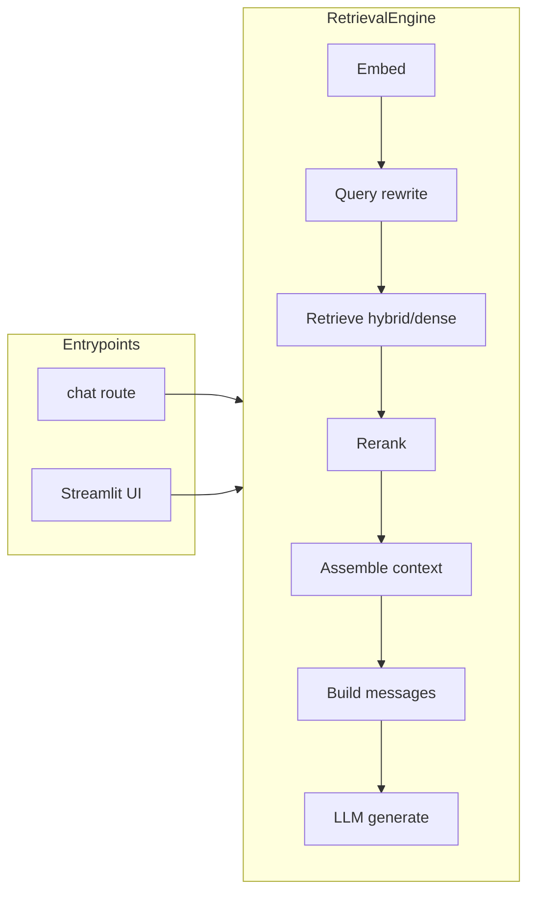

# RAG Pipeline Map (Current State)

This document describes the current retrieval flow from entrypoint to LLM response. Used for RAG Reset Phase 0 inventory.

For a catalog of all retrieval-related config switches and their classification, see [RAG_CONFIG_CATALOG.md](RAG_CONFIG_CATALOG.md).

## Entrypoints

| Entrypoint | File | How engine is built | Method used |
|------------|------|---------------------|-------------|
| API chat (non-streaming) | `src/api/routes/chat.py` | `get_retrieval_engine` in `src/api/deps.py` | `engine.query(question=body.question)` |
| Streamlit UI | `src/ui/app.py` | `_get_services()` builds `RetrievalEngine` from `load_config()` | `engine.query_stream(question)` |

Engine construction: `src/api/deps.py` `get_retrieval_engine()` (API) and `src/ui/app.py` `_get_services()` (UI) both build `RetrievalEngine` from `src/core/config.load_config()` and `config/settings.yaml` under `retrieval:`.

## Non-streaming path: `RetrievalEngine.query()` (engine.py)

Call flow in order:

1. **Embed question**  
   - `engine.py`: `query_embedding = self.embedder.embed_text(question)`

2. **Query rewrite (advanced)**  
   - `engine.py`: `profile = detect_query_profile(question)` → `query_rewrite.py:detect_query_profile`  
   - `engine.py`: `entity_filter = self._build_metadata_filter(question)` → uses `query_rewrite.py:extract_query_entities`  
   - `engine.py`: `retrieval_query_text = self._build_retrieval_query_text(question, entity_filter, profile)`  
   - `engine.py`: `query_text_alt = generate_lexical_alt(retrieval_query_text)` → `query_rewrite.py:generate_lexical_alt`

3. **Retrieve**  
   - `engine.py`: `_retrieve_with_debug(retrieval_query_text, query_embedding, ...)`  
   - If hybrid: `vector_store.search_hybrid_with_debug()` → `pgvector_store.py:search_hybrid_with_debug` (or Chroma equivalent)  
   - Else: `_retrieve()` → `vector_store.search()` → `pgvector_store.py:search` or `chroma_store.search`

4. **Fallback**  
   - If entity-rewrite returned 0 results: retry with original question and `generate_lexical_alt(question)` (same flow as above).

5. **Rerank (optional)**  
   - `engine.py`: if `use_reranker` and `reranker`: `self.reranker.rerank(question, passages, top_n=rerank_top_n)` → `reranker.py:CrossEncoderReranker.rerank`  
   - Results reordered by rerank score; top `final_context_chunks` or `top_k` kept.

6. **Top-k / score threshold**  
   - `engine.py`: `search_results = search_results[:keep]` (keep = `final_context_chunks` if hybrid/reranker else `top_k`)  
   - If `score_threshold > 0`: filter to `relevant_results = [r for r in search_results if r.score >= score_threshold]`.

7. **Abstain check**  
   - `engine.py`: `_should_abstain(relevant_results)` (top1 score and margin vs `abstain_min_top1_score`, `abstain_min_margin`). If true, return no-context fallback via `NO_CONTEXT_GENERAL_PROMPT` and `llm.generate`.

8. **Context assembly**  
   - `engine.py`: `_assemble_context(relevant_results, question)` — prefix dedupe, similarity dedupe, then procedure/safety/spec ordering using `query_rewrite.py:is_safety_chunk`, `is_spec_or_table_chunk`, `detect_numeric_intent`.  
   - `engine.py`: `_format_context(assembled)` → chunks with `citation_bracket(metadata)` from `prompts.py:citation_bracket`.

9. **Prompt and generate**  
   - Two-pass (if `use_two_pass_answer`): `prompts.py:build_extract_sentences_messages` → `llm.generate` → `build_compose_from_extracted_messages` → `llm.generate`.  
   - Else: `prompts.py:build_chat_messages(user_question, context_chunks, conversation_history)` → `llm.generate(messages)`.

10. **Must-cite check**  
    - For profile in `("spec_lookup", "error_codes")`: if no citation pattern in answer, abstain and return no-context response.

11. **Return**  
    - `_repair_missing_citations`, `_extract_sources`, then `RetrievalResult(answer, sources, model, usage, confidence)`.

Debug trace (when `RAG_DEBUG_TRACE=1` or `return_debug=True`): built in `query()` as `trace` and `debug_out`; appended to `results/rag_debug_trace.jsonl` via `_append_debug_trace`.

## Streaming path: `RetrievalEngine.query_stream()` (engine.py)

- Same dependencies (embedder, vector_store, llm, config) but **no** `_retrieve_with_debug`; uses `_retrieve()` only.
- Flow: embed → `_retrieve(question, query_embedding, metadata_filter)` (no profile/entity/lexical in the call; `_retrieve` uses `_profile_params(profile)` but profile is not passed from `query_stream` — it defaults to `"general"` in `_retrieve` when called from `query_stream` with no profile).  
  Note: `query_stream` currently passes `question` and `metadata_filter`; internally it does not call query_rewrite (no `detect_query_profile`, etc.) before `_retrieve`. So streaming path is slightly simpler but still uses hybrid/rerank if configured.
- Then: optional rerank → top-k → score_threshold → `_assemble_context` → `_format_context` → `build_chat_messages` → `llm.stream(messages)`.
- Returns `(token_stream, sources)`.

## Diagram (advanced path)

Baseline path (Phase 1): Embed (after light normalize) → Retrieve (vector only) → Assemble (top-k, optional prefix dedupe) → Prompt → LLM.

## File:function reference (advanced path)

| Step | File | Function / method |
|------|------|--------------------|
| Embed | `src/retrieval/engine.py` | `embedder.embed_text(question)` |
| Query profile | `src/retrieval/query_rewrite.py` | `detect_query_profile` |
| Entity filter | `src/retrieval/engine.py` | `_build_metadata_filter` (uses `query_rewrite.extract_query_entities`) |
| Retrieval query text | `src/retrieval/engine.py` | `_build_retrieval_query_text` |
| Lexical alt | `src/retrieval/query_rewrite.py` | `generate_lexical_alt` |
| Retrieve with debug | `src/retrieval/engine.py` | `_retrieve_with_debug` |
| Hybrid search | `src/vectorstore/pgvector_store.py` | `search_hybrid_with_debug` |
| Dense search | `src/vectorstore/base.py` (interface), `pgvector_store.py` / `chroma_store.py` | `search` |
| Rerank | `src/retrieval/reranker.py` | `CrossEncoderReranker.rerank` |
| Profile params | `src/retrieval/engine.py` | `_profile_params` |
| Abstain | `src/retrieval/engine.py` | `_should_abstain` |
| Assemble context | `src/retrieval/engine.py` | `_assemble_context` (uses `query_rewrite.is_safety_chunk`, `is_spec_or_table_chunk`, `detect_numeric_intent`) |
| Format context | `src/retrieval/engine.py` | `_format_context` |
| Citation bracket | `src/llm/prompts.py` | `citation_bracket` |
| Chat messages | `src/llm/prompts.py` | `build_chat_messages` |
| Two-pass extract/compose | `src/llm/prompts.py` | `build_extract_sentences_messages`, `build_compose_from_extracted_messages` |
